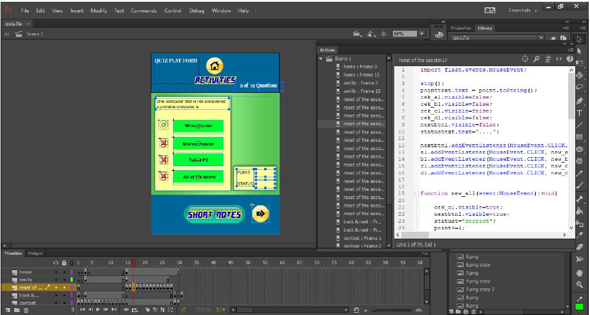

# Managing ICT Projects

  

This repository contains the project work for the "MANAGING ICT PROJECTS" course, which was completed as part of the International Advanced Level (UK High School) Applied ICT subject. The course covered various aspects of project management in the field of Information and Communication Technology.

## Project Plans
The project plans included the following tasks:
- Scope & Plan
- Designing
- Prototyping
- Project Review
- Prototyping II
- Project Review II
- Handover & End of Project Review

## Management
The management section encompassed activities such as:
- Meetings
- Comments
- Charts for project completion
- Agendas for Project Proposal, Scope & Plan, Designing, Prototyping, Project Review, Prototyping II, Handover & End of Project Review.

## Final Product: Multiple Quiz
The final product of the project is a multiple quiz developed using Flash. The quiz was created using simple Flash if-else coding. It is aimed at the students of St. Anthony’s College Kandy, a school in Sri Lanka following the G.C.E.(A/L) syllabus. The purpose of the product is to enhance the students' understanding of General Information Technology (GIT) and encourage them to apply ICT knowledge in their daily work.

### Reviewing Objectives
The main objectives of this project were to increase the distinction passes of G.C.E A/L students and promote the use of ICT knowledge in their daily activities. By distributing the GIT revision guide ebook during seminars, the project aimed to provide a comprehensive resource for students' IT revision.

### Development Criteria
The product was developed based on the following criteria:
- Targeted for all G.C.E Advanced Level students in all streams.
- Encouraging the use of ICT knowledge in daily work.
- Multimedia product running in Flash Player.
- Consistency throughout the project.
- User-friendly and interactive navigation system.
- Easy-to-learn contents and attractive animations.

### The Project Delivered
The project delivered 400 copies of the multimedia product. Each copy included a Read-Me (pdf) document file in the DVD disk drive.

### Shortcomings and Further Suggestions
One of the shortcomings was the inability to individually check all 400 copies for technical faults before distribution due to time constraints. However, the original tested version of the multimedia product was thoroughly reviewed and deemed to be error-free.

A further suggestion for improvement would be to expand the eBook to cover all other relevant topics, creating a comprehensive practice guide and revision pack for GCE A/L students.

### Reviewing Success Criteria
The key success criteria for the project were:
- Completing and publishing the multimedia product by 19th October 2018.
- Producing 400 copies of the multimedia product by 30th October 2018.
- Increasing the number of distinction passes by at least 10%.
- Attracting 20% of seminar participants from various friendly schools.

All stakeholders certified that the multimedia product met the key success criteria, making it a successful project.

### Comments from Clients
The project manager, Mr. Sadeesha Jayaweera, demonstrated excellent organizational skills and dedication throughout the project. The client expressed satisfaction with the project's execution, highlighting Mr. Sadeesha's professionalism and timely completion.

### Evaluation of Own Performance
The project executor reflected on their performance and identified the following:

#### Current Skill Level
Having previous experience with eBook creation using Dreamweaver and knowledge of JavaScript and jQuery, the multimedia eBook using Flash Professional CC 2015 was a new learning experience. Despite having low skills in using Flash software, the project executor utilized their knowledge from previous units in managing the project effectively.

#### Performance
The project executor employed Microsoft Office 2016 for various tasks, including document editing and conversion to PDF

 format. They also utilized Microsoft Project 2016 for tracking project progress using Gantt Charts. Communication with stakeholders was carried out through email and a dedicated WhatsApp group. Agendas and meeting minutes were created using Microsoft Office and shared with project partners. Feedback from end users was carefully analyzed and incorporated into the final product.

#### Areas to Improve
Improving animation skills in Adobe Flash Professional would have enhanced the multimedia product by incorporating more multimedia components. Additionally, time management could be improved to ensure tasks are completed within the estimated timeframes.

### Overall Conclusion
The project can be considered highly successful, meeting all key success criteria and client requirements. The stakeholder's satisfaction further validates its success.
